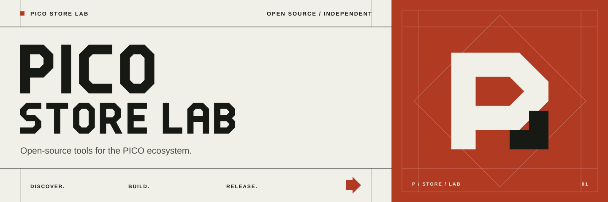

# PICO Store Lab

[](https://github.com/nkanf-dev/pico-store-lab/actions/workflows/ci.yml)
[](LICENSE)
[](https://github.com/nkanf-dev/pico-store-lab/releases)

[简体中文](README.zh-CN.md) · [Contributing](CONTRIBUTING.md) · [Security](SECURITY.md) · [Releasing](RELEASING.md)

An independent, developer-focused PICO release index and SDK suite. The first supported item is the **native PICO VRChat package** (`com.vrchat.android`), not the Google Play mobile app. PICO Store Lab is not affiliated with PICO or VRChat.

Live release page: **[pico.kanglives.top](https://pico.kanglives.top)**. The public page tracks release metadata only; account sign-in and APK installation stay in the private clients.

## What is here

| Component | Language | Role | Verified in this release |
| --- | --- | --- | --- |
| `packages/ts` | TypeScript | Store requests, exact-ID response parsing, mirror/release policy | Strict build and contract tests |
| `packages/python` | Python | Typed protocol and mirror policy, small CLI | Ruff PEP checks, tests, wheel/sdist |
| `packages/rust` | Rust | Typed protocol and mirror policy | fmt, Clippy, tests |
| `packages/kotlin` | Kotlin | Android-compatible protocol and mirror policy | JVM unit tests and AAR build |
| `apps/website` | TypeScript SDK + Cloudflare Worker | Bilingual public release page and monotonic version tracker | Local/fixture tests; deployed to Cloudflare |
| `apps/desktop-rs` | Rust SDK | Desktop CLI for account login and verified downloads | Compiles and tests; no GUI yet |
| `apps/android` | Kotlin SDK | PICO on-device status, sign-in and system-confirmed install | APK builds; **not headset-tested** |
| `apps/desktop` | JavaScript legacy | Earlier working prototype and local mirror sync | Retained for migration/reference |

The four SDKs use a shared [contract fixture](contracts/v1/fixtures.json). They construct and validate official request/response shapes; they do **not** silently fetch, log in, install, or publish APKs. The item ID is larger than JavaScript's safe integer range and is preserved exactly. Release tracking keeps the highest known version, deduplicates history, and retains the last good snapshot after a failed check.

## Get started

The project is a single monorepo. Use only the language you need:

```sh
# TypeScript SDK and Website tests — Node.js 25+
npm ci
npm test
node apps/website/src/dev.js                 # http://127.0.0.1:8787

# Python SDK — Python 3.11+
PYTHONPATH=packages/python/src python3 -m unittest discover -s packages/python/tests
PYTHONPATH=packages/python/src python3 -m pico_store_lab --help

# Rust SDK and Desktop CLI — Rust 1.85+
cargo test --workspace
cargo run -p pico-store-desktop -- --help

# Kotlin SDK and PICO Android client — Java 17, Android SDK 35
cd apps/android
./gradlew testDebugUnitTest assembleDebug
```

The Android debug APK is at `apps/android/app/build/outputs/apk/debug/app-debug.apk`. It requests Android's normal installation confirmation; it does not silently install. The PICO account session is kept in native process memory only and is lost when the client exits. Headset runtime verification remains open until a device is connected.

### SDK examples

```ts
import { makePublicItemRequest, parseOfficialJson, parsePublicItem } from '@nkanf-dev/pico-store-sdk';
const request = makePublicItemRequest();
const item = parsePublicItem(parseOfficialJson(await (await fetch(request.url, request)).text()));
console.log(item.versionCode);
```

```python
from pico_store_lab import make_public_item_request
request = make_public_item_request()
print(request.url)
```

```rust
use pico_store_lab::make_public_item_request;
let request = make_public_item_request();
println!("{}", request.url);
```

```kotlin
val request = PicoProtocol.publicItemRequest()
val item = PicoProtocol.parsePublicItem(responseText)
```

SDK package names are prepared for registries but **only GitHub source and release artifacts are published in this first pass**. PyPI, npm, crates.io, and Maven Central publication is deferred by design.

## Accounts, APKs and mirroring

The Rust and Python CLIs support public status, email-code sign-in, and an explicit verified download path. Use `--help` for exact options. Never share an auth file. The legacy JS CLI also supports local mirror sync with an operator-specified directory; the default policy selects free APKs below 512 MiB. The Cloudflare page checks public metadata daily; it does not host APKs or account sessions, and no R2 bucket is configured. This repository's MIT license covers **our code only**; it does not grant redistribution rights to third-party APKs.

Please report security issues privately as described in [SECURITY.md](SECURITY.md). For development and release standards, see [CONTRIBUTING.md](CONTRIBUTING.md) and [RELEASING.md](RELEASING.md).
